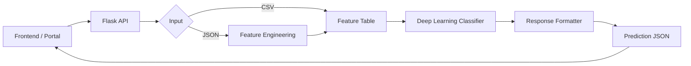
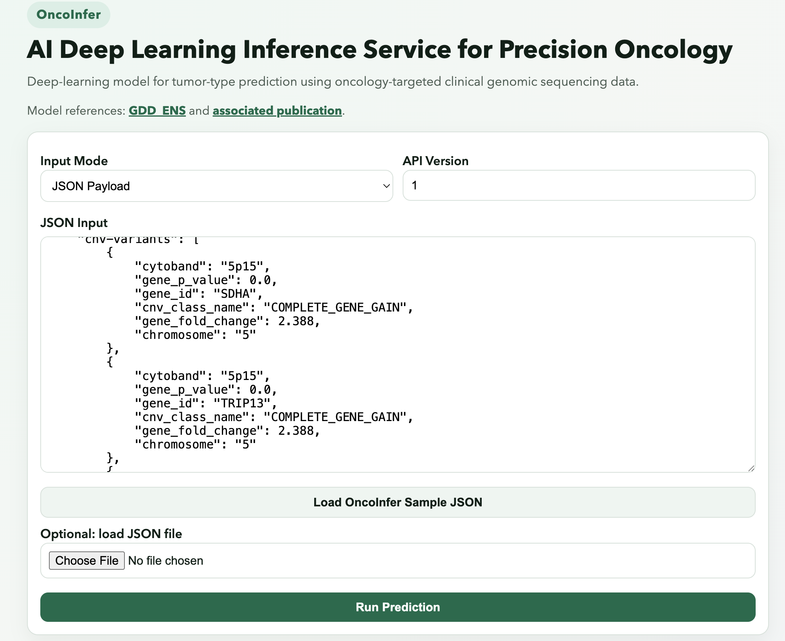

# OncoInfer
## AI Deep Learning Inference Service for Precision Oncology

OncoInfer is a Flask-based inference service built on a deep-learning model for tumor-type prediction using targeted clinical genomic sequencing data. It accepts molecular-feature JSON payloads or feature-table uploads, runs the deep learning inference pipeline, and returns structured JSON predictions. The service also includes a React frontend portal and can be integrated with clinical or pathology portals to render predictions in downstream workflows.

## Architecture Snapshot



## UI Preview



## Table of Contents

- [Tech Stack](#tech-stack)
- [Architecture Snapshot](#architecture-snapshot)
- [Key Capabilities](#key-capabilities)
- [System Architecture](#system-architecture)
- [Repository Layout](#repository-layout)
- [API Contract](#api-contract)
- [Local Development](#local-development)
- [Testing](#testing)
- [Docker](#docker)
- [Frontend (OncoInfer Portal)](#frontend-oncoinfer-portal)
- [Example API Usage](#example-api-usage)
- [Example Files](#example-files)
- [Notes on Large Artifacts](#notes-on-large-artifacts)
- [Model References](#model-references)

## Tech Stack

- Backend: Python, Flask, Gunicorn
- Machine Learning / Data: PyTorch, SHAP, pandas, NumPy, scikit-learn, scipy
- Bioinformatics preprocessing: pybedtools, pyfaidx, bedtools
- Frontend: React, Vite
- Packaging/Runtime: Conda (`environment.yml`), Docker
- Testing: pytest

## Key Capabilities

- REST API for single-sample tumor classification
- Support for both molecular-feature JSON and tabular feature-file inputs
- End-to-end inference pipeline (feature parsing, model scoring, response serialization)
- Structured JSON output with top predictions and feature-importance context

## System Architecture

- API layer handles endpoint routing, validation, and request orchestration.
- Input supports molecular-feature JSON or precomputed feature CSV.
- Processing pipeline performs feature engineering, deep-learning inference, and response formatting.
- Output is a structured prediction JSON consumed by frontend and portal integrations.
- Model/reference artifacts are loaded from `libraries/` at runtime.

## Repository Layout

```text
.
├── app.py
├── app/
│   ├── config.py
│   ├── routes.py
│   └── services/
│       └── inference_service.py
├── frontend/
│   ├── src/
│   ├── public/
│   └── package.json
├── libraries/
│   ├── parse_dmp_json.py
│   ├── run_gdd_single.py
│   ├── write_output_json.py
│   ├── gdd_ensemble.py
│   └── train_gdd_nn.py
├── Dockerfile
├── environment.yml
├── examples/
│   ├── input/
│   ├── intermediate/
│   └── output/
├── templates/
└── static/
```

## API Contract

### `POST /classify/<version>`

Runs classification for one sample.

Accepted request types:

1. `application/json`: molecular feature payload
2. `multipart/form-data`: file field named `features`

Response:

- `200 OK` with JSON prediction object
- `4xx/5xx` with JSON error message when request parsing or inference fails

### `GET /health`

Simple service health probe.

### `GET /docs`

Returns a simple JSON endpoint reference for demos/presentations.

### `GET /openapi.json`

Returns the OpenAPI 3 schema.

### `GET /openapi`

Interactive Swagger UI for the API.

## Local Development

```bash
conda env create -f environment.yml
conda activate oncoinfer
python app.py
```

`requirements.txt` contains Python packages only. Native/system dependencies such as `bedtools` are installed via Conda or the Docker image.

## Testing

```bash
pytest
```

## Docker

```bash
docker build -t oncoinfer .
docker run --rm -p 8080:8080 oncoinfer
```

The Docker image creates the `oncoinfer` Conda environment from `environment.yml` and starts the API with Gunicorn.

## Frontend (OncoInfer Portal)

The React portal is in `frontend/` and supports:

- JSON payload submission
- CSV feature-file upload (form field: `features`)
- Inline prediction JSON display

Run order for local development:

```bash
# Terminal 1 - backend
conda activate oncoinfer
python app.py

# Terminal 2 - frontend
cd frontend
npm install
npm run dev
```

Open `http://localhost:5173`.

## Example API Usage

```python
import json
import requests

with open("examples/input/sample_request.json", "r") as f:
    payload = json.load(f)

response = requests.post("http://localhost:8080/classify/1", json=payload)
print(response.status_code)
print(response.json())
```

## Example Files

- Request examples: `examples/input/`
- Intermediate pipeline artifacts: `examples/intermediate/`
- Response examples: `examples/output/`

All shared examples should be de-identified before commit.

## Notes on Large Artifacts

This service requires runtime model/reference artifacts in `libraries/` (for example: `ensemble.pt`, `gddnn_kmeans_output.bz2`, `gr37.fasta`, `gr37.fasta.fai`, and CSV annotation files).

Recommended approach for a public repository:

- Keep large artifacts outside Git history
- Host artifacts in a private storage location (for example cloud bucket or private release assets)
- Download/copy artifacts into `libraries/` during deployment before starting the API

Without those files, the container/API boots but inference requests will fail.

## Model References

- Deep-learning model architecture and code reference: [GDD_ENS](https://github.com/mmdarmofal/GDD_ENS)
- Publication reference: [Deep-Learning Model for Tumor-Type Prediction Using Targeted Clinical Genomic Sequencing Data](https://pubmed.ncbi.nlm.nih.gov/38416134/)
